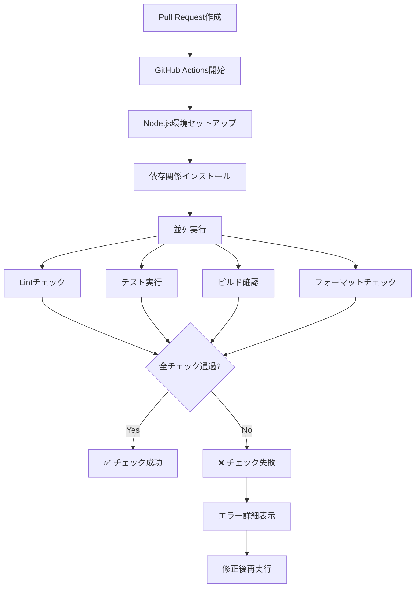
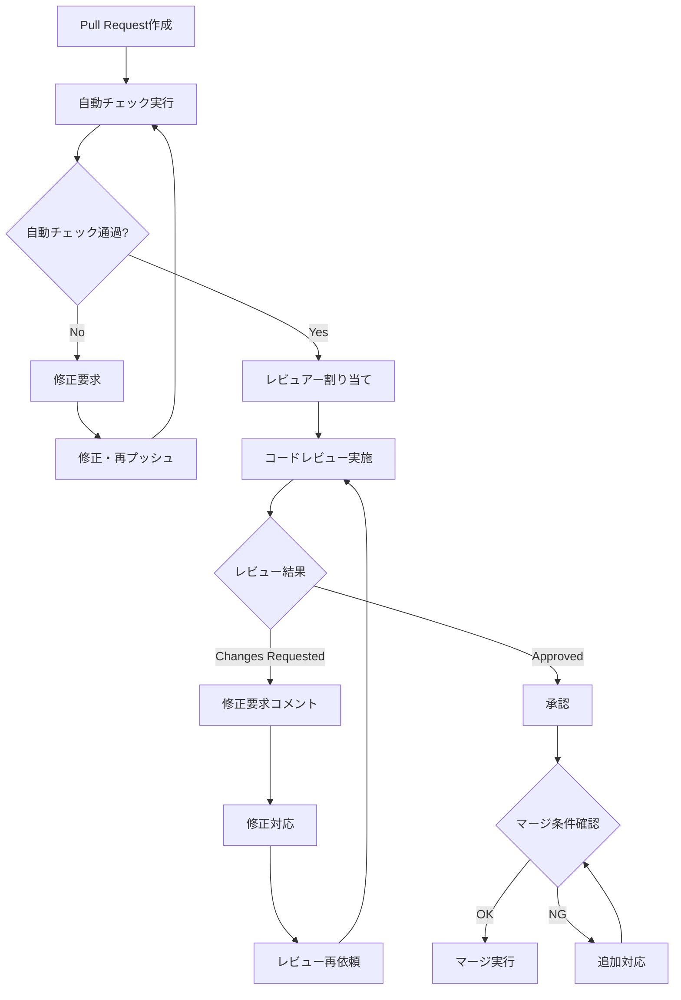

# Contributing to backlog-exporter

backlog-exporterへの貢献を歓迎します！

## 開発環境のセットアップ

### 前提条件

- Node.js 18以上
- npm
- Git

### セットアップ

```bash
# リポジトリをクローン
git clone https://github.com/ShuntaToda/backlog-exporter.git
cd backlog-exporter

# 依存関係をインストール
npm install

# ビルド
npm run build

# テスト実行
npm test
```

### 開発コマンド

```bash
npm run build        # TypeScriptをビルド
npm run format       # コードフォーマット（自動修正）
npm run format:check # コードフォーマットチェック（修正なし）
npm run lint         # ESLint実行
npm test             # テスト実行
```

### コード品質チェック

プロジェクトでは以下の品質チェックを実施しています：

#### ローカルでの品質チェック実行

Pull Requestを作成する前に、ローカルで以下のコマンドを実行して品質チェックを行ってください：

```bash
# 1. コードフォーマットの確認
npm run format:check

# 2. Lintチェック
npm run lint

# 3. テスト実行
npm test

# 4. ビルド確認
npm run build

# 全てを一度に実行（推奨）
npm run format:check && npm run lint && npm test && npm run build
```

#### GitHub Actionsによる自動チェック

Pull Requestを作成すると、GitHub Actionsが以下のチェックを自動実行します：

##### 実行されるチェック項目

1. **Lintチェック (`npm run lint`)**
   - ESLintによるコード品質チェック
   - TypeScriptの型チェック
   - コーディング規約の遵守確認

2. **テスト実行 (`npm test`)**
   - Mochaによる単体テスト実行
   - テストカバレッジの確認
   - 既存機能の回帰テスト

3. **ビルド確認 (`npm run build`)**
   - TypeScriptコンパイルの確認
   - 依存関係の整合性チェック
   - 実行可能ファイルの生成確認

4. **フォーマットチェック (`npm run format:check`)**
   - Prettierによるコードフォーマット確認
   - 一貫したコードスタイルの維持

##### 自動チェックの流れ



これらのチェックが全て通過しないと、Pull Requestをマージできません。

##### チェックが失敗した場合の詳細な対処法

**1. Lintエラーの対処**

```bash
# エラー確認
npm run lint

# 自動修正可能なエラーを修正
npm run lint -- --fix

# 手動修正が必要なエラーは個別に対応
```

**2. テストエラーの対処**

```bash
# 失敗したテストを確認
npm test

# 特定のテストファイルのみ実行
npm test -- --grep "テスト名"

# テストの詳細出力
npm test -- --reporter spec
```

**3. ビルドエラーの対処**

```bash
# ビルドエラーの詳細確認
npm run build

# TypeScriptの型チェックのみ実行
npx tsc --noEmit

# 依存関係の問題確認
npm ls
```

**4. フォーマットエラーの対処**

```bash
# フォーマット問題の確認
npm run format:check

# 自動フォーマット実行
npm run format

# 特定ファイルのみフォーマット
npx prettier --write "src/**/*.ts"
```

## プロジェクト構造

```
src/
├── commands/          # CLIコマンド実装
│   ├── all/           # 一括エクスポート
│   ├── document/      # ドキュメントエクスポート
│   ├── issue/         # 課題エクスポート
│   ├── update/        # 更新
│   └── wiki/          # Wikiエクスポート
└── utils/             # ユーティリティ関数
```

## 貢献の方法

### バグ報告

[GitHub Issues](https://github.com/ShuntaToda/backlog-exporter/issues)でバグを報告してください。

以下の情報を含めてください：

- OS・Node.jsバージョン
- 再現手順
- 期待される動作と実際の動作
- エラーメッセージ

### 機能提案

新機能の提案もIssuesで受け付けています。

- 機能の説明
- 使用場面
- 実装案（もしあれば）

### Pull Requestワークフロー

#### 1. 事前準備

1. **リポジトリをフォーク**
   - GitHubでリポジトリをフォークしてください
2. **ローカルにクローン**

   ```bash
   git clone https://github.com/YOUR_USERNAME/backlog-exporter.git
   cd backlog-exporter
   ```

3. **依存関係をインストール**

   ```bash
   npm install
   ```

4. **上流リポジトリの追加**

   ```bash
   git remote add upstream https://github.com/ShuntaToda/backlog-exporter.git
   ```

5. **最新の状態を取得**
   ```bash
   git fetch upstream
   git checkout main
   git merge upstream/main
   ```

#### 2. 開発作業

1. **フィーチャーブランチを作成**

   ```bash
   git switch -c feature/your-feature-name
   ```

   ブランチ名の規則：
   - `feature/機能名` - 新機能追加
   - `fix/修正内容` - バグ修正
   - `docs/文書名` - ドキュメント更新
   - `refactor/対象` - リファクタリング
   - `test/テスト対象` - テスト追加・修正

2. **実装とテストを追加**
   - 機能を実装してください
   - 新機能には必ずテストを追加してください
   - 既存のテストが壊れていないことを確認してください
   - コードコメントを適切に追加してください

3. **ローカルでの品質チェック**

   ```bash
   # 全ての品質チェックを実行
   npm run format:check && npm run lint && npm test && npm run build
   ```

4. **定期的に変更をコミット**

   ```bash
   git add .
   git commit -m "feat: 機能の説明"
   ```

5. **開発中に上流の変更を取り込む**
   ```bash
   git fetch upstream
   git rebase upstream/main
   ```

#### 3. Pull Request作成

1. **最終的な品質チェック**

   ```bash
   # 最新の上流変更を取り込む
   git fetch upstream
   git rebase upstream/main

   # 全ての品質チェックを実行
   npm run format:check && npm run lint && npm test && npm run build
   ```

2. **変更をコミット**

   ```bash
   git add .
   git commit -m "feat: 機能の説明"
   ```

   コミットメッセージの規則：
   - `feat:` - 新機能
   - `fix:` - バグ修正
   - `docs:` - ドキュメント更新
   - `test:` - テスト追加・修正
   - `refactor:` - リファクタリング
   - `style:` - コードスタイル変更（機能に影響なし）
   - `perf:` - パフォーマンス改善
   - `chore:` - ビルドプロセスやツール変更

3. **フォークにプッシュ**

   ```bash
   git push origin feature/your-feature-name
   ```

4. **Pull Requestを作成**
   - GitHubでPull Requestを作成してください
   - Pull Requestテンプレートに従って必要な情報を記入してください
   - 関連するIssueがある場合は、Pull Request説明文に `Closes #123` のように記載してください
   - 適切なラベルを付けてください

#### 4. コードレビュープロセス

##### レビューの観点と基準

**コード品質**

- **可読性**: 変数名・関数名が適切で、コードの意図が明確
- **保守性**: 適切な関数分割と責任の分離
- **一貫性**: プロジェクトの既存コードスタイルとの整合性
- **エラーハンドリング**: 適切な例外処理とエラーメッセージ

**機能性**

- **要件充足**: Issueや仕様に対する適切な実装
- **エッジケース**: 境界値や異常系の考慮
- **後方互換性**: 既存機能への影響の最小化
- **パフォーマンス**: 処理効率とメモリ使用量の最適化

**テスト品質**

- **カバレッジ**: 新機能に対する適切なテストの存在
- **テストケース**: 正常系・異常系の網羅
- **テストの可読性**: テストコードの理解しやすさ
- **モック・スタブ**: 外部依存の適切な分離

**セキュリティ**

- **入力検証**: ユーザー入力の適切なバリデーション
- **機密情報**: ハードコードされた認証情報の排除
- **依存関係**: 脆弱性のあるパッケージの使用回避
- **権限管理**: 適切なアクセス制御

**ドキュメント**

- **コメント**: 複雑なロジックに対する適切な説明
- **API文書**: 公開関数・メソッドの使用方法説明
- **更新**: 変更に伴うREADMEなどの更新

##### レビューワークフロー



##### マージ条件の詳細

**必須条件**

- [ ] 全てのGitHub Actionsチェックが通過
- [ ] 最低1名のメンテナーによる承認
- [ ] コンフリクトが解決済み
- [ ] 適切なコミットメッセージ
- [ ] 関連するドキュメントの更新
- [ ] 新機能に対するテストの追加

**推奨条件**

- [ ] テストカバレッジの維持・向上
- [ ] パフォーマンスの劣化なし
- [ ] 破壊的変更の事前告知
- [ ] 新機能の使用例やドキュメント
- [ ] コードコメントの充実

##### 特殊なケースの対応

**緊急修正（Hotfix）**

- 重大なバグの場合は迅速レビューを実施
- 最小限の修正に留める
- 修正後に包括的なテストを実施
- `hotfix/` プレフィックスのブランチを使用

**大規模な変更**

- 事前にIssueで設計を議論
- 段階的なPull Requestに分割
- 早期のフィードバックを求める
- 設計ドキュメントを作成

**実験的機能**

- フィーチャーフラグの使用を検討
- 十分なテストとドキュメントを用意
- 段階的なロールアウト計画を策定
- `experimental/` プレフィックスのブランチを使用

**依存関係の更新**

- セキュリティ更新は優先的に対応
- 破壊的変更を含む更新は慎重に検討
- 更新による影響範囲を明確に記載
- 依存関係更新専用のPull Requestを作成

#### 注意事項

- ESLintとPrettierの設定に従ってください
- 新機能にはテストを追加してください
- エラーメッセージは日本語で記述してください
- 破壊的変更を含む場合は、事前にIssueで相談してください
- コードコメントは日本語で記述してください
- コミットメッセージの本文は日本語で詳細を記述しても構いません

## テスト

```bash
# 全テスト実行
npm test

# 特定のテストファイル実行
npm test -- --grep "test-pattern"

# カバレッジレポート生成
npm test -- --coverage
```

### テスト作成ガイドライン

1. **テストの構造**
   - 各機能ごとに対応するテストファイルを作成
   - `describe` ブロックで機能単位をグループ化
   - `it` ブロックで個別のテストケースを記述

2. **テストケースの網羅**
   - 正常系: 期待通りの入力での動作確認
   - 異常系: エラー入力での適切な処理確認
   - 境界値: 制限値付近での動作確認

3. **モックの活用**
   - 外部依存（API、ファイルシステム等）はモック化
   - テスト間の独立性を確保

4. **テストの可読性**
   - テスト名は「何をテストするか」を明確に
   - 前提条件、実行、検証を明確に分ける
   - 複雑なテストデータは変数や関数で整理

```typescript
// テスト例
describe('issue command', () => {
  it('正しいパラメータで実行された場合、課題をエクスポートする', async () => {
    // 前提条件
    const mockBacklog = {
      /* ... */
    }

    // 実行
    const result = await exportIssue(params)

    // 検証
    expect(result).to.have.property('success', true)
    expect(fs.existsSync(outputPath)).to.be.true
  })

  it('無効なAPIキーの場合、適切なエラーを返す', async () => {
    // テスト内容
  })
})
```

## 技術仕様

- **言語**: TypeScript 5.x
- **ランタイム**: Node.js >=18.0.0
- **CLIフレームワーク**: oclif v4
- **HTTPクライアント**: ky
- **テスト**: Mocha + Chai

## 質問・相談

- 使い方の質問: [GitHub Discussions](https://github.com/ShuntaToda/backlog-exporter/discussions)
- バグ報告・機能提案: [GitHub Issues](https://github.com/ShuntaToda/backlog-exporter/issues)

皆様の貢献をお待ちしています！
